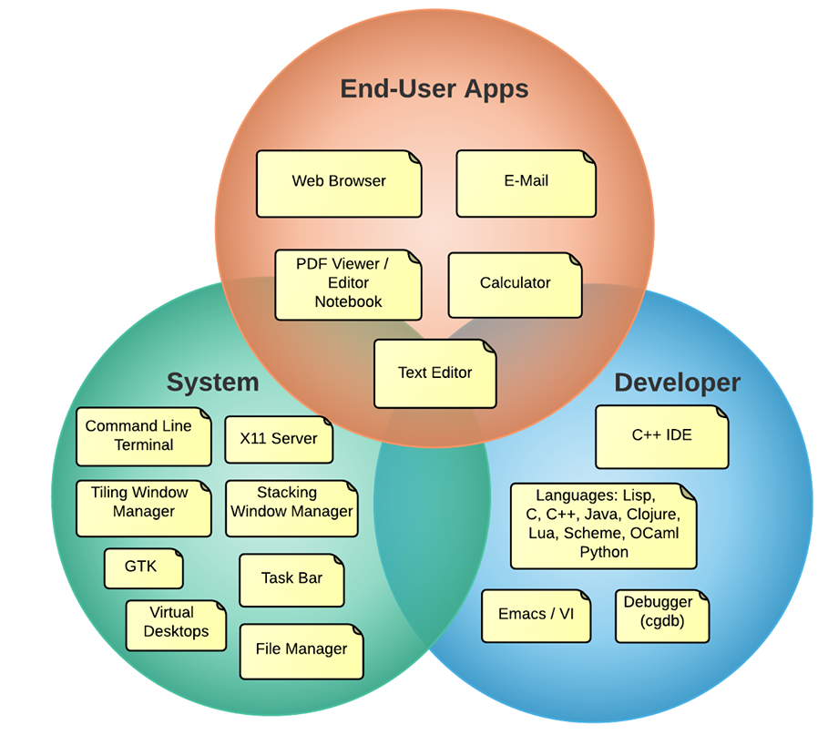

# qmole-packages
QMole Debian Packages

[QMole Main Github Repository](https://github.com/chriskmanx/qmole)

## Manifest

### REPO

The hosted repository - what Cydia connects to for installation to iPhone & iPad via dedicated Cydia source.

### DEBS

Debian package sources used to build the REPO. 

### scripts

Various helper and build scripts to assist with building the REPO.

### Avian tar archive

Archive build of the Avian light weight Java virtual machine for iOS

## Licence Disclaimer

QMole is hereby released open-source under the GPL. Previous releases were licensed closed-source (this continues to apply to the existing binaries up to and including beta version 0.7). The reason for the closed-source release is that QMole has dependencies on screen viewer libraries which themselves are closed-source and licensed content. Adopters have 3 main choices:

1. Also license the screen viewer libraries; please contact [ABTO Software](http://remote-screen.com)
2. Adapt the GPL licence compatible [Google Code VNSea](https://code.google.com/archive/p/vnsea/)
3. Use RealVNC's viewer on the Apple APP Store directly; please refer to [VNC Viewer](https://itunes.apple.com/us/app/vnc-viewer/id352019548?mt=8)

Each approach as its merits. The existing implementation is optimized for use with QMole including swipe control overlays (the scroll ribbon) and fine-tuned mouse control that make standard X11 Linux applications readily usable on a touch screen with limited screen real estate. Google Code's VNSea has the benefit of being open source, but will need adapting for use with QMole. RealVNC's viewer is a turn-key solution, but will need to be separately launched as it cannot be directly integrated with QMole.  All three merely need to form loopback connections to the local device, so are never used as "remote" viewers.

## iOS Compatibility Notes

The last version of iOS for which I maintained QMole was iOS 8. Apple has changed binary formats a number of times since the initial release of iOS, moving from 32 bit to 64 bit formats in the process. The latest version of iOS requires a rebuild of the current sources but is otherwise expected to work in full. A rooted device is required in all cases.

## Android Compatibility Notes

It is expected that QMole would function on Android devices after appropriate recompilation of the sources. Packages like [Termux](https://termux.com) and [GNURoot](https://play.google.com/store/apps/details?id=champion.gnuroot&hl=en) are expected to be usable with QMole - even without rooting or "jail-breaking" the device.

## Happy Hacking!

